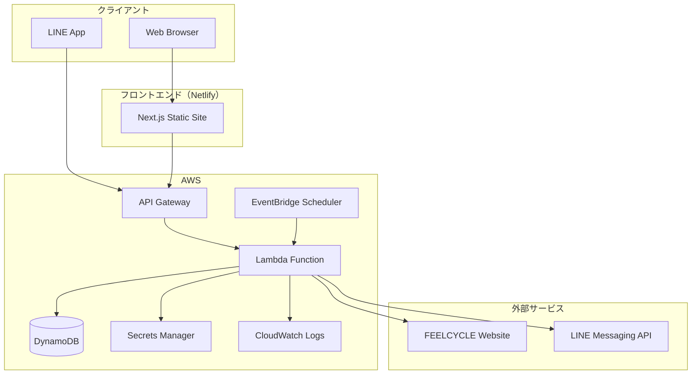
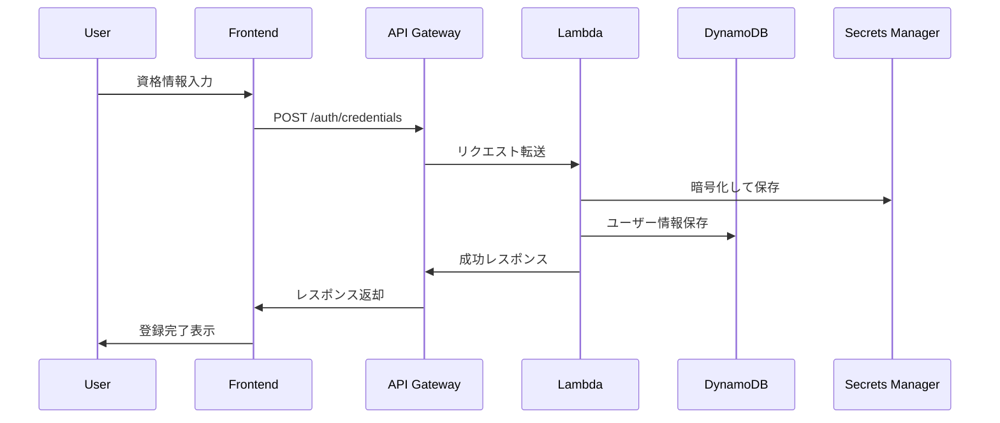
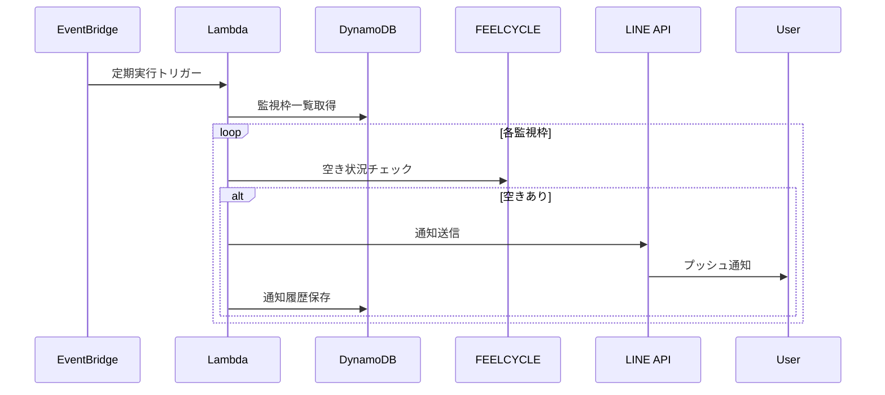

# FEELCYCLE Hub - アーキテクチャ設計書

## システム概要

FEELCYCLE Hubは、FEELCYCLEユーザーのレッスン予約支援を目的としたサーバーレスアプリケーションです。AWS Lambda + DynamoDBを基盤とし、LINE Messaging APIを通じて通知機能を提供します。

## アーキテクチャ図

## 主要コンポーネント

### 1. フロントエンド
- **技術**: Next.js 14 (Static Export)
- **ホスティング**: Netlify Free Tier
- **機能**: 
  - ユーザー登録・設定
  - 監視枠管理
  - 受講履歴表示
  - LINE Login連携

### 2. バックエンド API
- **技術**: AWS Lambda (Node.js 20, ARM64)
- **API Gateway**: REST API
- **機能**:
  - 資格情報管理（暗号化保存）
  - レッスン監視・通知
  - 自動予約機能
  - 受講履歴取得・分析

### 3. データベース
- **技術**: DynamoDB On-Demand
- **テーブル設計**:
  - Users: ユーザー情報
  - Reservations: 予約・監視状況（TTL有効）
  - LessonHistory: 受講履歴

### 4. 定期実行
- **技術**: EventBridge Scheduler
- **間隔**: 本番1分、STG 5分
- **機能**: レッスン空き状況チェック

### 5. 通知システム
- **技術**: LINE Messaging API
- **機能**: 
  - 空き枠通知
  - 予約完了通知
  - エラー通知

## データフロー

### 1. ユーザー登録フロー

### 2. 監視・通知フロー

## セキュリティ設計

### 1. 認証・認可
- LINE Login（OAuth 2.0）
- JWT トークンベース認証
- API Gateway レベルでの認証チェック

### 2. データ保護
- FEELCYCLE資格情報はAES-256で暗号化
- Secrets Manager使用（自動ローテーション対応）
- DynamoDB暗号化（AWS Managed Keys）

### 3. 通信セキュリティ
- 全通信HTTPS強制
- CORS設定によるオリジン制限
- CSP ヘッダーによるXSS対策

### 4. 監査・ログ
- CloudWatch Logs（7日保持）
- API Gateway アクセスログ
- Lambda実行ログ

## パフォーマンス設計

### 1. レスポンス時間
- API Gateway: < 100ms
- Lambda Cold Start: < 3s (ARM64最適化)
- DynamoDB: < 10ms (On-Demand)

### 2. スループット
- API Gateway: 10,000 req/sec
- Lambda: 並行実行数制限（dev: 2, prod: 1000）
- DynamoDB: 40,000 RCU/WCU

### 3. 可用性
- Lambda: 99.95%
- DynamoDB: 99.99%
- API Gateway: 99.95%
- 目標: 99.5%

## スケーラビリティ

### 1. 水平スケーリング
- Lambda: 自動スケーリング
- DynamoDB: On-Demandによる自動スケーリング
- API Gateway: 自動スケーリング

### 2. データ分割
- DynamoDB パーティションキー設計
- ユーザーIDベースの分散

### 3. キャッシュ戦略
- Lambda間でのインメモリキャッシュ
- DynamoDB DAX（将来検討）

## 運用・監視

### 1. メトリクス
- Lambda実行時間・エラー率
- DynamoDB スループット使用率
- API Gateway レスポンス時間

### 2. アラート
- エラー率 > 5%
- レスポンス時間 > 5s
- コスト > 700円/月

### 3. ログ管理
- 構造化ログ（JSON）
- ログレベル: INFO, WARN, ERROR
- 個人情報マスキング

## コスト最適化

### 1. 月次コスト目標
- 総額: < 1,000円
- 主要コスト:
  - DynamoDB: ~250円
  - Secrets Manager: ~200円
  - CloudWatch Logs: ~50円

### 2. 最適化施策
- Lambda ARM64使用（20%コスト削減）
- DynamoDB On-Demand（使用量ベース）
- CloudWatch Logs 7日保持
- 開発環境の並行実行制限

### 3. コスト監視
- AWS Budgets（700円アラート）
- 日次コストレポート
- リソース使用量ダッシュボード

## 災害対策

### 1. バックアップ
- DynamoDB PITR（本番環境）
- Secrets Manager自動バックアップ
- Lambda関数コードはGit管理

### 2. 復旧戦略
- RTO: 4時間
- RPO: 1時間
- 手動復旧手順書の整備

## 今後の拡張性

### 1. 機能拡張
- 複数ブランド対応
- プッシュ通知（PWA）
- 機械学習による予約最適化

### 2. 技術拡張
- GraphQL API
- WebSocket（リアルタイム通知）
- CDN導入（グローバル展開）